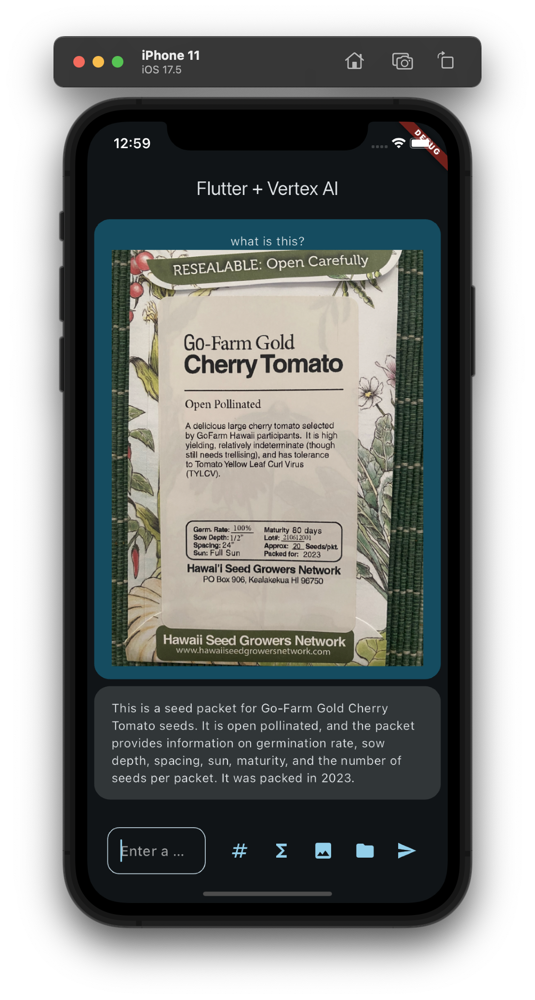
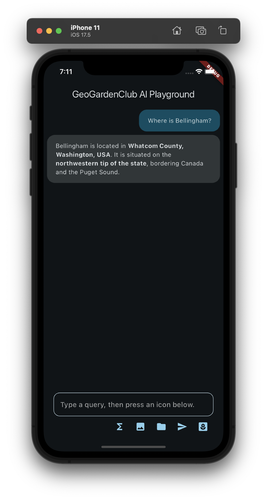
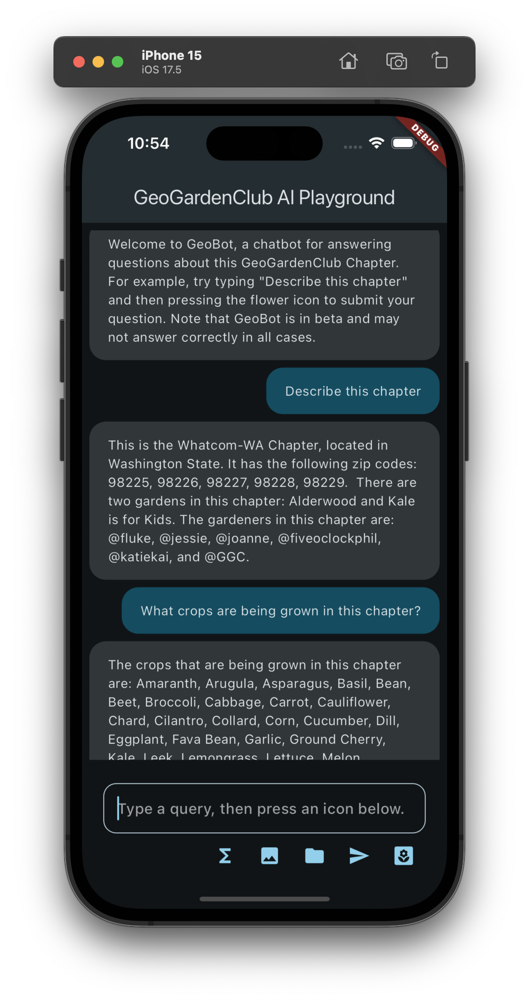

# GeoGardenClub_AI_Playground

The goal of this app is to support the design of a chatbot to answer questions about a GeoGardenClub chapter. The chatbot is implemented using Google's Gemini technology and its function call API which enables it to access the GGC chapter database.  Some potential questions might be:

* How many gardens (or gardeners, crops, varieties, plantings, etc) are in this chapter?
* What variety of basil is best to grow?
* Who has a lot of experience growing ground cherries?
* What kind of problems might come up if I grow cherry tomatos?
* Please use the information in this photo of a seed packet to define this seed, variety, and crop in the chapter database.

## Background

GeoGardenClub_AI_Playground is a refactored and extended version of the [sample app](https://github.com/firebase/flutterfire/tree/master/packages/firebase_vertexai/firebase_vertexai/example) in [Get started with the Gemini API using the Vertex AI for Firebase SDKs](https://firebase.google.com/docs/vertex-ai/get-started?platform=flutter).

The original sample app is useful because it implements several relevant features:

1. How to choose and initialize a Gemini model in Flutter, using the (currently recommended) Firebase VertexAI interface.
2. How to implement a UI in Flutter for displaying a chat session between a user and the Gemini model. This includes preventing the user from initiating another request while the model is still working on the previous request.
3. How to implement several important Gemini interaction modalities, including:
  * text only, 
  * text plus image(s), 
  * text plus Firebase Storage file(s), and 
  * text plus a "Gemini Function Call" (which is how the model interacts with the GeoGardenClub database).

To build this app, the original sample app was first refactored from a single main.dart file containing all of the code into around a dozen files.  This refactoring helped clarify the design and separate UI code from "business logic". More importantly, it made it easier to extend the system with new functionality to explore the integration of Gemini models with GeoGardenClub data.

## Installation

Install this system according to the documentation in [Get started with the Gemini API using the Vertex AI for Firebase SDKs](https://firebase.google.com/docs/vertex-ai/get-started?platform=flutter). 

Specifically, you must [Set up a Firebase project and connect your app to Firebase](https://firebase.google.com/docs/vertex-ai/get-started?platform=flutter).   You do not need to perform the remaining steps in this documentation page (i.e. "Add the SDK", "Initialize the Vertex AI service and the generative model", "Call the Vertex AI Gemini API"); these have already been done in the app.

Note that GeoGardeClub_AI_Playground does not actually read or write to the connected Firebase database; you just need this connection in order to define and use the Gemini models through the Vertex AI APIs.

Once you've connected your instance of the app to Firebase, you should be able to run the app as a normal Flutter project. For example, with:

```
flutter run
```

If all goes according to plan, the app will come up and look something like this:



The basic interaction with the app is to type a prompt into the text field, then press one of the icons below to send the query to the connected Gemini model. The model generates a response and both the prompt and the response are printed in the screen. For example, after typing "Where is Bellingham?" and pressing the Send (arrow) icon, the following appears in the screen:



Each icon invokes the Gemini model with the text prompt in a different way:
* Sigma icon (ExchangeRateCommand): Illustrates how to define and invoke a Gemini "function call". In this case, the command implements a fake API to an exchange rate application. Type in a query such as "What is the exchange rate of Dollars to Swedish Krona?" and press this icon to invoke the function call and print the response.
* Image icon (ImageQueryCommand): Pressing this icon sends a hardcoded image to the Gemini model, along with the prompt text. Type a query such as "What is this?" and press this icon to obtain a description of the image. You can edit the image to be sent by editing the code in the ImageQueryCommand class.
* Folder icon (StorageQueryCommand): This works just like the ImageQueryCommand, except that instead of sending an image (encoded as a byte stream) to the Gemini Model, the command instead sends the URI to a Google Storage file along with the prompt text. This URI is hardcoded in the StorageQueryCommand file. (The response does not display the image at the URI at this time, just the prompt and the response.)
* Send icon (TextSendCommand): Sends just the prompt text.  Both the text and the Gemini model's response are printed.

The above icons implement the functions provided by the sample app, and are provided just to ensure that this refactoring has not inadvertently introduced a bug into the system.  

The actual motivation for this app is the final (flower) icon in the row, which implements an interface to a mockup of a GeoGardenClub database and allows experimentation with the quality of responses provided by the model. 

For example, here is a conversation with an early implementation of the chatbot:



This early implementation has a few problems:

1. There was a "quota exceeded" error midway through, which went away when I re-requested. 
2. It gave the wrong answer to "How many gardens are in GeoGardenClub?" but the right answer when I reworded the prompt as "How many gardens are associated with gardeners in GeoGardenClub?"

So, the goal of development is to gain expertise with "prompt engineering" in order to provide a high quality chat bot to end users. 

## Design

As noted above, I refactored the single main.dart file of the sample app into a set of files in order to more clearly indicate its structure, and to facilitate its use to explore what the Gemini model can do when provided with GGC data.  Here's an outline of the app's design with a subset of files:

```
lib/                                 # top-level files implement the UI
  main.dart                          
  geogardenclub_ai_playground.dart   
  chat_screen.dart
    :                   
  commands/                          # Implements the icons in the UI
    exchange_rate_command.dart       
    image_query_command.dart         
    storage_query_command.dart       
    ggc_command.dart
     :                
  tools/                             # Gemini Tools for mockup db access
    exchange_rate_tool.dart          
    ggc_find_gardens.dart            
    ggc_find_gardeners.dart
     :
  data/                              # mockup GGC data
    fixture1/
      bed_data.dart
      gardener_data.dart
      garden_data.dart
      :
```

Basically, the top-level files in the lib/ directory implement the UI. Each file in the commands/ directory implements a Widget that interacts with the Gemini model in a certain way (i.e. text only, text + image, text + firebase storage, etc), and shows up as an icon underneath the text field. The tools/ directory more-or-less implements the "prompt engineering": how the model accesses data about GeoGardenClub. Finally, the data/ directory supports multiple configurations of mockup data, each configuration called a "fixture". Currently there is only one fixture.

## Prompt Engineering for GeoGardenClub

(more to come)
