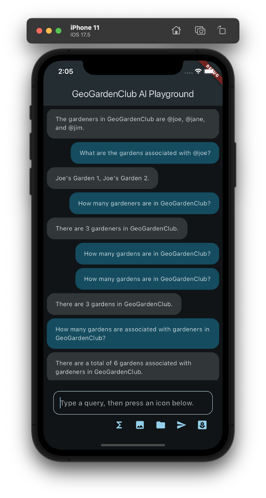

# GeoGardenClub_AI_Playground

The goal of this app is to support the design of a chatbot to answer questions about a GeoGardenClub chapter by accessing the chapter database.  Some potential questions might be:

* How many gardens (or gardeners, crops, varieties, plantings, etc) are in this chapter?
* What variety of basil is best to grow?
* Who has a lot of experience growing ground cherries?
* What kind of problems might come up if I grow cherry tomatos?
* Please use the information in this photo of a seed packet to define this seed, variety, and crop in the chapter database.

## Background

GeoGardenClub_AI_Playground is a refactored and extended version of the [sample app](https://github.com/firebase/flutterfire/tree/master/packages/firebase_vertexai/firebase_vertexai/example) in [Get started with the Gemini API using the Vertex AI for Firebase SDKs](https://firebase.google.com/docs/vertex-ai/get-started?platform=flutter).

The original sample app is useful because it implements several relevant features:

1. How to choose and initialize a Gemini model in Flutter, using the (currently recommended) Firebase VertexAI interface.
2. How to implement a UI in Flutter for displaying a chat session between a user and the Gemini model. This includes preventing the user from initiating another request while the model is still working on the previous request.
3. How to implement several important Gemini interaction modalities, including:
  * text only, 
  * text plus image(s), 
  * text plus Firebase Storage file(s), and 
  * text plus a "Gemini Function Call" (which is how the model interacts with the GeoGardenClub database).

To build this app, the original sample app was first refactored from a single main.dart file containing all of the code into around a dozen files.  This refactoring helped clarify the design and separate UI code from "business logic". More importantly, it made it easier to extend the system with new functionality to explore the integration of Gemini models with GeoGardenClub data.

## Installation

Install this system according to the documentation in [Get started with the Gemini API using the Vertex AI for Firebase SDKs](https://firebase.google.com/docs/vertex-ai/get-started?platform=flutter). 

Specifically, you must [Set up a Firebase project and connect your app to Firebase](https://firebase.google.com/docs/vertex-ai/get-started?platform=flutter).   You do not need to perform the remaining steps in this documentation page (i.e. "Add the SDK", "Initialize the Vertex AI service and the generative model", "Call the Vertex AI Gemini API"); these have already been done in the app.

Note that GeoGardeClub_AI_Playground does not actually read or write to the connected Firebase database; you just need this connection in order to define and use the Gemini models through the Vertex AI APIs.

Once you've connected your instance of the app to Firebase, you should be able to run the app as a normal Flutter project. For example, with:

```
flutter run
```

If all goes according to plan, the app will come up and look something like this:


Note that the set of icons at the bottom of the screen may differ from what appears in this image. That's because each icon is connected to a different "command" (explained below) and not all of them might be enabled in the UI at the time you install the system.

## Design

As noted above, I refactored the single main.dart file of the sample app into a set of files in order to more clearly indicate its structure, and to facilitate its use to explore what the Gemini model can do when provided with GGC data.

The current structure encapsulates each type of interaction with the Gemini model as an instance of a "command".  This makes it straightforward to create a new "command" like "GgcDataCommand" that sets up function calls to the GGC database and allows the user to ask questions about it. 

The main.dart file invokes GeoGardenClubAiPlayground() to kick things off.

The two most important top-level classes are:
* GeoGardenClubAiExample: Creates a MaterialApp that displays a ChatScreen.
* ChatScreen: Selects and initializes a Gemini AI model, and then displays a screen that processes a "command" invoked the user. Each command gets the user's prompt from the text field, passes it (potentially along with other prompt-related information) to the Gemini model, and displays the prompt and the response in the screen.

The ChatScreen UI is implemented using the following classes:
* MessageWidget: Displays a single command from the user and the results from the AI in the ChatWidget window to that prompt.
* GeneratedContent: A Widget displaying the sequence of commands and responses as a list of MessageWidgets.

At the bottom of the ChatScreen is full width text field along with a row of icons, each representing a different "command" that enables the user to interact with the Gemini model in various ways. These commands are located in the commands/ subdirectory. The following commands implement the functionality available as part of the sample app:

* Sigma icon (ExchangeRateCommand): Illustrates how to define and invoke a Gemini "function call". In this case, the command implements a fake API to an exchange rate application. Type in a query such as "What is the exchange rate of Dollars to Swedish Krona?" and press this icon to invoke the function call and print the response.
* Image icon (ImageQueryCommand): Pressing this icon sends a hardcoded image to the Gemini model, along with the prompt text. Type a query such as "What is this?" and press this icon to obtain a description of the image. You can edit the image to be sent by editing the code in the ImageQueryCommand class. 
* Folder icon (StorageQueryCommand): This works just like the ImageQueryCommand, except that instead of sending an image (encoded as a byte stream) to the Gemini Model, the command instead sends the URI to a Google Storage file along with the prompt text. This URI is hardcoded in the StorageQueryCommand file. (The response does not display the image at the URI at this time, just the prompt and the response.)
* Send icon (TextSendCommand): Sends just the prompt text.  Both the text and the Gemini model's response are printed.

## Reasoning about GeoGardenClub data

All of the above is just preliminary to the real focus of this app: exploring the best approach to enabling a Gemini model to reason about and answer questions regarding GeoGardenClub data. To do this, this app emulates the approach taken by the original sample to illustrate how a model can interact with an external API. The original app implements the "exchange rate tool" as an async function that, instead of actually calling an external service, immediately returns a JSON-style object that emulates what such as service might return. 

Similarly, this app implements a variety of tools that return objects similar to what might be returned by a call to an actual GeoGardenClub database. 

To explore the ability of a Gemini model to reason about GeoGardenClub data, this app contains two files in the commands directory:

* ggc_command.dart: Implements the UI (the flower icon, appearing last in the row of icons), plus the "processing logic", which means invoking the function calls requested by the model in sequence until the model returns a text response, which is then printed. 
* ggc_tools.dart:  Implements the "business logic", which is a set of functions that enable the Gemini model to query the underlying GGC database.  These functions do not currently connect to the GGC database; instead, they return mockup data. Nevertheless, they serve to help explore the capabilities of the model and what functions might be required to provide a good user experience.

Here is an example interaction that shows the capabilities of the model:



Note that I got a "quota exceeded" error midway through, which went away when I re-requested. Also note that it gave the wrong answer to "How many gardens are in GeoGardenClub?" but the right answer when I reworded the prompt as "How many gardens are associated with gardeners in GeoGardenClub?"
