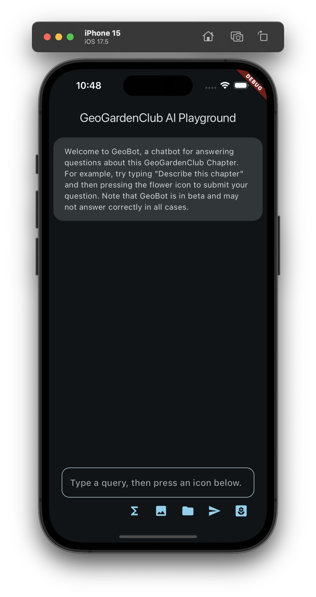

# firebase_vertexai_example

This is a highly refactored version of the "sample app" in [Get started with the Gemini API using the Vertex AI for Firebase SDKs](https://firebase.google.com/docs/vertex-ai/get-started?platform=flutter). 

## Installation

The documentation states it needs to be connected to a Firebase project, so I've connected it to the Firebase ggc_app database following the instructions in the Getting Started page referenced above.

You should be able to just download and run the app without changes. 

## Structure

Once the app was working, I refactored the single main.dart file into a set of files in order to more clearly indicate its structure. The main.dart file invokes FirebaseVertexAiExample to kick things off.

The two top-level classes are:

* FirebaseVertexAiExample: Creates a MaterialApp that displays a ChatScreen.
* ChatScreen: Selects and initializes a Gemini AI model. Then displays a screen that processes a "command" invoked the user. Each command gathers some data, passes the data to the Gemini model, and displays the data and the response.

ChatScreen is implemented using the following classes:
* MessageWidget: Displays a single command from the user and the results from the AI in the ChatWidget window to that prompt.
* GeneratedContent: A Widget displaying the sequence of commands and responses as a list of MessageWidgets.

At the bottom of the ChatScreen is a row of "commands" that enable the user to interact with the Gemini model in various ways. These commands are located in the commands/ subdirectory:

* ExchangeRateCommand (Sigma icon): Illustrates how to define and invoke a Gemini "function call". In this case, the command implements a fake API to an exchange rate application. Pressing the icon generates a fake user prompt and call to the API which is processed by the Gemini model and whose response is printed.
* TextFieldCommand (Text field): The user can enter any text into the field and press return (or the Send icon). The prompt is sent to the Gemini model and this prompt as well as the response is printed.
* TokenCountCommand (hashtag icon): Pressing this icon illustrates how to obtain the token count and billable characters associated with a prompt. This information is printed to the console.
* ImageQueryCommand (image icon): Pressing this icon sends a hardcoded image to the Gemini model, along with the text provided by the user in the TextField. You can edit the image to be sent by editing the code in the ImageQueryCommand class. 
* StorageQueryCommand (folder icon): This works just like the ImageQueryCommand, except that rather than sending an image (encoded as a byte stream) to the Gemini Model, the command instead sends the URI to a Google Storage file along with the text provided by the user. This URI is hardcoded in the StorageQueryCommand file.
* TextSendCommand (send icon): Sends the text in the TextField. Equivalent to pressing "return" in the TextField. Both the text and the Gemini model's response are printed.
